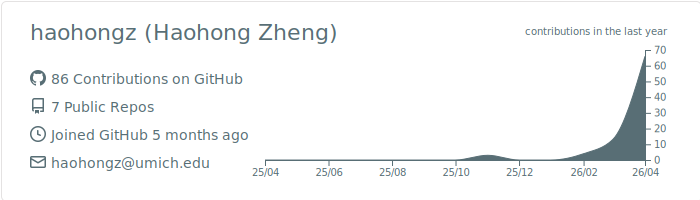
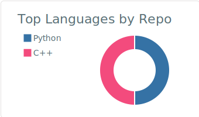
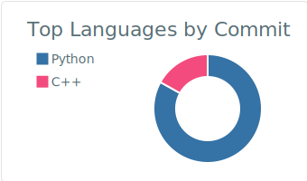
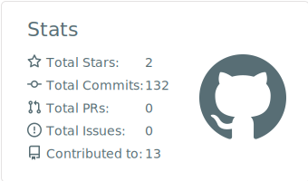
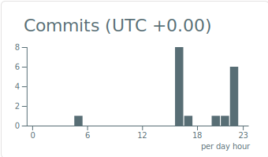

<!-- 打字机动态文字 -->
[;Statistics+%26+Data+Science+%40+UMich)](https://git.io/typing-svg)

---

### 🎓 About Me

🔬 Undergraduate Research Assistant @ University of Michigan, Ann Arbor  

📊 Double Major in **Statistics** & **Data Science** (BS) , Minor in **Computer Science** & **Business** 

🧠 Interested in **Causal Inference** · **Machine Learning** · **Biostatistics** · **TabPFN** · **Synthtic Data**

🎯 Aspiring PhD Candidate (Stats/ Data Science / Precision Medicine / Biostat / ML / Computer Science) 

📫 Reach me at **haohongz@umich.edu**

---

### 🛠️ Tech Stack

<!-- Languages -->

<!-- ML / DL -->

<!-- Tools -->

---

### 📈 GitHub Stats

  

  
  

  
  

### 🐍 Contribution Snake

  

---

  <i>"All models are wrong, but some are useful." — George E. P. Box</i>

